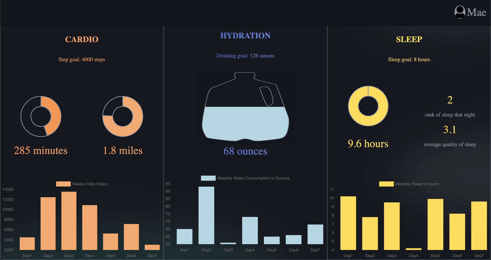

# FitLit Starter Kit

#### A Project for a fitness app setup

## Overview

* An app that displays users fitness data on multiple chart

## Features

* Shows user cardio, hydration, and sleep for a specified day
* Updates to a new user every 24 seconds
* Use of charts.js to display fitness information

## Set-up

* Create a repository and clone it to your local computer
* Open it in your text editor
* Read the `README.md`
* In the terminal run the command `open index.html` for initial deployment and interaction with app

## Contributors

* [Ryan Miller](https://github.com/Ryan-D-Miller)
* [Dustin Harbaugh](https://github.com/Dustin-Har)

##### Future Iterations Should Include:

* Day selection, be able to select the day you want to see

## Preview

Dashboard 
 

